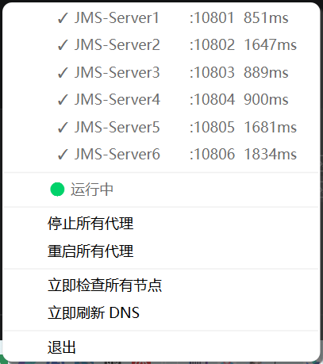

# OneProxy

[](LICENSE)
[](https://go.dev/)
[](https://www.qt.io/)

> [English](README.md) | 简体中文

Windows 多端口代理聚合器 — 将多个上游代理节点（Shadowsocks/VMess）转换为独立的本地 SOCKS5 端口，通过原生 C++ Qt6 系统托盘 GUI 管理。

## 架构

```
上游代理 (Shadowsocks/VMess)
        │
        ▼
  oneproxy.dll  ←─── Go 核心：配置解析、sing-box 管理、健康检查、DNS 刷新
        │
        ├─→ oneproxy-tray.exe  (C++ Qt6 系统托盘) ← 主界面
        │
        └─→ oneproxy.exe       (Go 命令行工具，可选)
```

**核心特性：**
- 🎯 **多端口映射** — 每个上游节点 → 独立本地 SOCKS5 端口（如 :10801, :10802...）
- 🩺 **健康监控** — 自动延迟检查，可视化状态指示
- 🔄 **DNS 管理** — 故障时自动刷新系统 DNS + 重启 sing-box
- 🪟 **原生 GUI** — Qt6 系统托盘，无控制台窗口，轻量（~2 MB）
- ⚙️ **基于 sing-box** — 久经考验的代理核心，支持多种协议

---

## 截图

### 系统托盘菜单
<kbd></kbd>

显示所有代理：
- ✓ 健康状态（绿/黄/红指示器）
- 端口号和延迟（毫秒）
- 启动/停止/重启控制
- 手动健康检查和 DNS 刷新触发器

### 健康检查运行中
<kbd></kbd>

每 60 秒自动后台检查（可配置）。失败节点触发 DNS 刷新和重试。

---

## 快速开始

### 前置要求

| 组件 | 版本 | 用途 |
|------|------|------|
| **Windows** | 10/11 | 目标操作系统 |
| **Go** | 1.21+ | 构建 DLL |
| **MSVC** | 2022 | 构建 C++ 托盘 |
| **Qt** | 6.8+ | GUI 框架 |
| **sing-box** | 最新版 | 代理引擎 |

### 安装

#### 1. 下载 sing-box

```powershell
# 从 https://github.com/SagerNet/sing-box/releases 下载
# 将 sing-box.exe 解压到 OneProxy/bin/
mkdir bin
# 将 sing-box.exe 放入 bin/
```

#### 2. 配置代理

```powershell
# 复制示例配置
cp configs\config.example.json config.json

# 编辑 config.json 填入你的代理信息
notepad config.json
```

配置示例：

```json
{
  "proxies": [
    {
      "name": "美国节点-1",
      "enabled": true,
      "local_port": 10801,
      "type": "shadowsocks",
      "server": "us1.example.com",
      "port": 8388,
      "method": "aes-256-gcm",
      "password": "你的实际密码"
    }
  ]
}
```

完整配置参考见 [docs/configuration.zh.md](docs/configuration.zh.md)。

#### 3. 构建

```powershell
# 一键构建（需要 MSVC 2022 + Qt6 在 PATH 中）
.\build.ps1
```

如果构建失败，参见 [docs/installation.zh.md](docs/installation.zh.md) 手动设置。

#### 4. 运行

```powershell
.\trayapp\build\oneproxy-tray.exe
```

托盘图标出现在系统托盘（右下角）。右键打开菜单。

---

## 使用方法

### 验证代理

```powershell
# 用 curl 测试 SOCKS5 端口
curl -x socks5://127.0.0.1:10801 https://ip.sb
# 应返回你的代理出口 IP
```

### 配置浏览器

**Firefox：**
1. 设置 → 网络设置 → 手动代理配置
2. SOCKS 主机：`127.0.0.1`，端口：`10801`
3. SOCKS v5：✓

**Chrome/Edge：**
```powershell
# 使用代理启动（替换 10801 为你的端口）
chrome.exe --proxy-server="socks5://127.0.0.1:10801"
```

**系统全局代理（Windows）：**
1. 设置 → 网络和 Internet → 代理
2. 手动设置 → SOCKS 代理：`127.0.0.1:10801`

### 托盘菜单操作

| 操作 | 效果 |
|------|------|
| **启动所有代理** | 启动所有已启用的代理 |
| **停止所有代理** | 停止 sing-box，关闭所有端口 |
| **重启所有代理** | 重启 + 触发健康检查 |
| **立即检查所有节点** | 手动健康检查（跳过 60 秒间隔） |
| **立即刷新 DNS** | 刷新系统 DNS + 重启 sing-box |
| **退出** | 停止代理并退出程序 |

**图标颜色：**
- 🟢 绿色 — 所有代理健康
- 🟡 黄色 — 部分代理超时
- 🔴 红色 — 全部故障或已停止

---

## HTTP/HTTPS 代理支持

OneProxy 默认提供 **SOCKS5** 代理。如需 **HTTP/HTTPS** 代理：

### 方法 1：修改配置（推荐）

编辑 `config.json`，将 `inbound.proxy_type` 改为 `http`：

```json
{
  "inbound": {
    "listen": "127.0.0.1",
    "proxy_type": "http"
  }
}
```

重启代理后，所有端口变为 HTTP CONNECT 代理：

```powershell
# 测试 HTTP 代理
curl -x http://127.0.0.1:10801 https://ip.sb

# 浏览器设置
# Firefox: HTTP 代理 127.0.0.1:10801
# Chrome: --proxy-server="http://127.0.0.1:10801"
```

### 方法 2：混合模式

在 `config.json` 中为每个代理单独设置：

```json
{
  "proxies": [
    {
      "name": "SOCKS5-Node",
      "local_port": 10801,
      "inbound_type": "socks5"  // 此端口为 SOCKS5
    },
    {
      "name": "HTTP-Node",
      "local_port": 10802,
      "inbound_type": "http"    // 此端口为 HTTP
    }
  ]
}
```

**注意：** 
- HTTP 代理**不支持 UDP**（如 DNS 查询），SOCKS5 支持
- 部分应用（如 Telegram）仅支持 SOCKS5
- 性能：SOCKS5 略优（协议更简单）

### 路由模式

OneProxy 支持三种路由模式，通过托盘菜单切换：

| 模式 | 行为 |
|------|------|
| **全局** | 所有流量走代理（默认） |
| **规则** | 国内 IP/域名直连，其他走代理 |
| **直连** | 所有流量直连，不走代理 |

规则模式使用 sing-box 内置的 `rule_set` 路由功能，搭配社区维护的数据库：

| 数据库 | 大小 | 用途 |
|--------|------|------|
| `geoip.db` | 4 MB | IP 地址 → 国家/地区映射 |
| `geosite.db` | 3.5 MB | 域名 → 分类（cn、ads 等） |

这些数据库由 [SagerNet 社区](https://github.com/SagerNet/sing-geoip/releases) 维护，可独立更新。启动时自动复制到 `~/.oneproxy/` 目录。

这是**服务端路由**，对所有经过代理的应用生效，与 PAC 脚本仅在浏览器层面工作不同。

---

## API 参考

### 命令行工具 (oneproxy.exe)

```powershell
# 启动所有代理
.\oneproxy.exe start

# 停止所有代理
.\oneproxy.exe stop

# 显示状态（JSON）
.\oneproxy.exe status

# 健康检查
.\oneproxy.exe check

# 刷新 DNS
.\oneproxy.exe flush
```

### DLL 导出函数 (oneproxy.dll)

```c
char* OneProxy_Start(char* configPath);     // 返回错误或 NULL
char* OneProxy_Stop();
char* OneProxy_Restart();
char* OneProxy_Status();                    // JSON 字符串
char* OneProxy_HealthCheck();
char* OneProxy_FlushDNS();
void  OneProxy_FreeString(char* ptr);       // 释放返回的字符串
```

实现见 `cmd/oneproxy-dll/main.go`。

---

## 故障排查

### 找不到 sing-box.exe
```
Error: failed to start sing-box: exec: "bin/sing-box.exe": file does not exist
```
**解决方案：** 从 [releases](https://github.com/SagerNet/sing-box/releases) 下载 sing-box 并放入 `OneProxy/bin/`。

### 端口已被占用
```
Error: listen tcp 127.0.0.1:10801: bind: Only one usage of each socket address
```
**解决方案：** 其他进程正在使用该端口。修改 `config.json` 中的 `local_port` 或终止冲突进程：
```powershell
netstat -ano | findstr :10801
taskkill /PID <PID> /F
```

### 健康检查总是失败
```
所有代理显示红色，延迟 = 超时
```
**原因：**
1. 上游服务器故障 — 联系提供商
2. config.json 中密码/UUID 错误
3. 防火墙拦截出站连接 — 将 sing-box.exe 添加到 Windows 防火墙例外
4. DNS 污染 — 从托盘菜单运行"立即刷新 DNS"

查看日志：
```powershell
type logs\singbox.log
```

### 托盘图标不显示
- Qt 平台插件缺失 — 确保 build 目录下存在 `platforms\qwindows.dll`
- 从 PowerShell 运行查看错误输出：
```powershell
cd trayapp\build
.\oneproxy-tray.exe
# 查看控制台输出
```

更多问题？见 [docs/troubleshooting.zh.md](docs/troubleshooting.zh.md)

---

## 项目结构

```
OneProxy/
├── cmd/
│   ├── oneproxy/          # Go 命令行工具
│   └── oneproxy-dll/      # Go DLL（C 共享库）
├── internal/
│   ├── config/            # 配置解析器 + sing-box 配置生成器
│   │   ├── config.go      # JSON 反序列化、验证
│   │   └── singbox.go     # 从配置生成 sing-box JSON
│   └── proxy/             # 核心代理管理
│       ├── manager.go     # 进程生命周期，Start/Stop/Restart
│       ├── health.go      # 带超时的健康检查器
│       └── dns.go         # DNS 刷新器（ipconfig /flushdns + 重启）
├── trayapp/               # C++ Qt6 系统托盘
│   ├── CMakeLists.txt     # MSVC 构建配置
│   ├── main.cpp           # QSystemTrayIcon + DLL FFI
│   └── *.ico              # 绿/黄/红状态图标
├── configs/
│   └── config.example.json
├── bin/                   # sing-box 二进制（用户提供）
├── logs/                  # sing-box 标准输出/错误
├── build.ps1              # 一键构建脚本
└── config.json            # 用户配置（已忽略）
```

---

## 开发

参见 [CONTRIBUTING.zh.md](CONTRIBUTING.zh.md)：
- 开发环境设置
- 构建系统详解（Go 构建模式、Qt/CMake、MSVC 工具链）
- 代码结构和约定
- 运行测试
- 提交 PR

---

## 性能

- **内存占用：** ~15 MB（oneproxy-tray.exe + DLL + Qt 运行时）
- **CPU 使用率：** 空闲 <1%，健康检查期间 <5%
- **延迟开销：** 每个代理跳 ~5-10ms（本地 SOCKS5 中继）
- **并发连接数：** 受 sing-box 限制（通常每端口 1000+ 连接）

---

## 部署清单

将 oneproxy-tray.exe 部署到其他 Windows 机器：

**必需文件：**
```
trayapp/build/
├── oneproxy-tray.exe
├── oneproxy.dll
├── config.json              # 你的代理配置
├── green.ico, yellow.ico, red.ico
├── Qt6Core.dll, Qt6Gui.dll, Qt6Widgets.dll
├── platforms/
│   └── qwindows.dll         # Qt 平台插件
└── bin/
    └── sing-box.exe         # 代理引擎
```

**可选：**
- `oneproxy.exe` — CLI 工具
- `logs/` — 自动创建用于 sing-box 输出

---

## 许可证

[MIT License](LICENSE) — Copyright (c) 2026 OneProxy Contributors

---

## 致谢

- **[sing-box](https://github.com/SagerNet/sing-box)** — 通用代理平台
- **[Qt](https://www.qt.io/)** — 跨平台 GUI 框架
- **[JustMySocks](https://justmysocks.net/)** — 示例上游提供商（非官方合作）

---

## 常见问题

**Q: 为什么不用 v2rayN 或 Clash？**  
A: OneProxy 将每个节点暴露为独立端口，支持按应用路由代理，无需切换配置文件。

**Q: 支持 macOS/Linux 吗？**  
A: Go DLL 核心跨平台，但 Qt 托盘应用目前仅支持 Windows。欢迎提交其他平台的 PR。

**Q: 可以用 HTTP 代理代替 SOCKS5 吗？**  
A: 可以。修改 `config.json` → `inbound` → `proxy_type` 为 `"http"`。sing-box 会在相同端口上创建 HTTP CONNECT 代理。

**Q: 如何添加新的代理节点？**  
A: 编辑 `config.json`，在 `proxies` 数组中添加新条目，指定唯一的 `local_port`，从托盘菜单重启。

**Q: 这比 VPN 快吗？**  
A: SOCKS5 代理开销低于 VPN（无 TUN/TAP 层），但速度取决于上游服务器质量。
